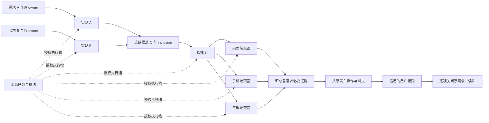

# 面向持续软件交付的资源与证据联合调度

日期：2026-09-25。状态：**研究方案，待讨论；未实施、无实验结果，不是 GSE 规范**。

## 1. 问题与设计目标

持续到达的需求由不同 Agent 执行，但会修改同一产品、争用构建资源和交互设备，并共享发布候选。一次 Agent 回合结束，不代表需求完成；一把锁能防冲突，却不能保证等待者恢复。依靠提示词要求“负责到底”，没有持久恢复协议，仍会留下无人推进的需求。

所有来源使用同一需求身份与执行机制。feature、bug、反馈、发布要求不作为两套工作流的分类依据。根据需求实际结果合同形成操作图；发布、人工接受和各端验收是其中的节点。一个发布节点可以服务多个需求，但必须逐项记录 inclusion 与接受证据。没有发布要求的操作不机械增加发布门；已有发布承诺也不能因源码完成被关闭。

目标是提高**有效验收完成的需求吞吐**，在相同模型、权限和预算下减少遗失等待、错误关闭、重复副作用和无效重验。不会承诺任意缺陷必然能修复。可以争取的保证是：每个已接纳需求都有责任人、下一动作或明确等待条件；可恢复故障不会静默丢失责任；持续失败进入有证据的升级或需求修订流程。

## 2. 成熟工程提供的基础

传统团队通常组合使用产品 backlog 与负责人、WIP 限制、小批次集成、CI/合并队列、发布管理和事故升级。负责人离开电脑后，责任仍由组织与台账承接。Agent 回合可以结束，但责任也需要从易失的对话转移到可恢复执行状态。

| 基础 | 可直接借鉴 | 覆盖边界 |
| --- | --- | --- |
| Temporal [S1–S2] | 持久事件、恢复、消息驱动、活动重试 | 不能仅靠重放保证外部发布恰好一次；需要幂等键与读回 |
| Kubernetes Controller [S3] | 观察目标/实际差距，执行收敛动作 | 调谐不等于周期写一份状态报告 |
| Bazel Skyframe [S4] | 动态依赖、逆向失效、变化剪枝 | 未声明的输入可能导致错误复用，不能让模型凭直觉证明无影响 |
| GitHub concurrency/merge queue [S5–S6] | 容量控制、基于集成候选验证 | 默认 pending 替换语义不是无损需求队列；合并不等于多端交付 |
| RCPSP [S7] | 前置约束、资源容量、调度目标 | 基础问题已是强 NP-hard；DAG、锁和优先级不是新算法贡献 |
| Workflow nets [S8] | 区分死锁、活锁与工作流可完成性 | 任意动态图不能无条件保证终止 |
| Lease/fencing [S9] | 防止失联旧执行者继续写入 | fencing 必须由资源端执行；TTL 到期不能证明旧进程停止 |

## 3. 四类关系组成一张交付图

不是单棵 tree，也不是把所有关系强行放进 DAG：

1. **需求与责任关系**：原需求 ID、generation、结果合同引用、原 owner。
2. **操作依赖 DAG**：当前 generation 内的实现、集成、构建、测试、安装、交互、发布、接受节点。失败产生新 attempt；需求改变产生新 generation，并明确旧结果的继承或废止。
3. **资源占用/等待图**：writer、构建、桌面、设备、发布通道等容量约束。单独检查等待环；不把“等某资源”当业务依赖完成。
4. **产物与证据关系**：候选包含哪些需求，证据依赖哪些源码、工具、环境、协议和验证器。发布共享、证据共享均为多对多关系。



图为需多端发布的示例，实际必要门由结果合同决定。并非每条需求等待图中所有需求完成才关闭。候选失败要定位受影响项；能安全排除失败变更时形成新候选并重验相关门，不能从已发布产物里假想删除某一项。

### 最小数据合同

| 对象 | 核心字段 |
| --- | --- |
| RequirementRef | source_ref、source_generation、owner_ref、contract_ref、authorization_ref |
| Operation | id、generation、kind、dependency_ids、input_digest、resource_demands、state、next_action、attempt |
| Candidate | source_commit、tree/manifest_digest、toolchain/config_digest、artifact_digest、requirement_inclusion |
| Evidence | candidate_ref、gate、validator_version、environment/protocol_digest、observed_result、receipt_ref、validity_dependencies |
| Wait | operation_ref、condition、resource_or_dependency、registered_revision、wake_cursor、next_reconcile_at |
| Attempt/Outbox | action_key、reservation、owner、dispatch_state、external_receipt、ack、failure_class、retry_at |

原 Task/Goal 是需求内容、责任与业务终态的权威；图是引用式投影。**事件日志、outbox、尝试与副作用回执是调度器自己的持久事实，不能当成随时可丢的缓存**。派生视图可重建，去重与恢复记录必须保留。不得复制全量个人数据或访问宿主的私有状态数据库。

## 4. 责任控制与状态转换

项目级控制器拥有“没有未登记的未完工作”这一职责；每个需求仍由原 owner 端到端负责。控制器决定资源许可、续执行及故障升级，不成为另一个随意改所有代码的超级 Agent。owner 活跃时不另派竞争者；失联后按官方接口恢复原任务或显式交接。

操作状态为 `pending → ready → reserved → running → verifying → succeeded`。旁路状态包括 `waiting_resource`、`waiting_dependency`、`waiting_human`、`retry_at`、`outcome_unknown`、`needs_decision`。`succeeded` 只表示该操作成功；需求完成还要满足全部必要门并读回原来源终态。取消/被替代必须有来源决定，不计为成功。

LLM 负责理解、修复、提出依赖和影响分析；确定性 Harness 负责身份、版本、状态转换、容量、幂等与证据门。依赖计划可能错误，需要循环检测、缺失前置核验及可审计修订；不能假设模型输出本身就是可靠调度图。

每个未完需求必须恰有可定位的责任归属，并满足至少一种情况：有可执行下一动作；已持久登记资源/依赖等待；存在重试时间；需要一个明确人工动作。有限重试预算耗尽后升级，不把失败节点循环重排来伪装进展。恢复调度不应无限消耗模型预算。

## 5. 调度与吞吐

先实现 **FIFO + aging + 容量限制 + 有界 WIP**，把它作为可运行的强基线。随后研究联合目标：缩短已验收需求的完成时间、减少重验成本，并约束最长等待和饥饿。不直接把未经验证的加权评分当最优算法。

在时刻 t，ready 集合中的操作只有当前置证据有效、授权满足、输入固定时才能竞选。选择集合 S，满足对每种资源 r：`sum(demand(o,r), o in S) <= capacity(r)`，并满足同源操作唯一预留。资源可用只是候选条件，实际执行仍需原子取得底层锁。

```text
reconcile(event_or_timer):
  读回来源版本、已知回执、资源实际状态；保留读取失败为 unknown
  在事务中更新图；使受影响证据失效；恢复未决 attempt
  对 outcome_unknown 先查回执，不直接重发
  从 ready frontier 选公平且容量兼容的一组操作
  在事务中 CAS 预留，写入 durable outbox
  executor 取得真实资源锁，复查输入版本与授权，再执行
  记录完成/失败/未知结果与证据；释放资源并写待发送事件
  推进后继；满足结果合同时由 owner 关闭来源并读回
```

原子操作范围只在自有 store 内；Git、设备、任务宿主与发布平台之间采用回执读回收敛，不能声称分布式事务。

共享 checkout 下编辑必须串行。若要让“候选 C 构建/验收”和“下一候选 D 编辑”重叠，必须先冻结 C 的完整只读源码与依赖 manifest，在允许的产物目录构建；不能边修改 checkout 边从它编译。设备只有一个 UI 会话时，即使有两个模拟器也应共享桌面锁。构建 slot 数不等于可同时 release build 数。

按下游容量拉取：验收队列过长时限制新实现进入，优先排空可交付工作。候选批次设最大等待/大小边界，避免不断合入新需求使旧需求永远轮不到发布。硬阻塞节点只阻塞真实依赖者，其他就绪节点继续执行。遇到共享坏候选则做隔离/修复决策，不能放行失败产物。

## 6. 可靠恢复协议

### 等待与唤醒

先持久登记 waiter，再检查资源 revision；释放产生事件，消费端使用去重键及 ack。事件与 outbox 尽量同事务记录。已有外部锁不能同事务时，使用 register/recheck 加周期对账覆盖窗口。事件至少一次投递；不能假设操作也恰好一次。

任务续执行状态至少区分 `pending → reserved → sent/unknown → acknowledged`。官方宿主如果不能提供幂等投递或精确执行回执，必须把该适配能力作为部署前验证项。不能把一次 send 成功当任务已推进，更不能因超时盲目创建重复任务。

### 锁与失联

逻辑预留加底层锁；多资源采用一致取锁顺序或一次性预留，拿不到释放已取资源，避免 hold-and-wait。租约超时触发诊断、回读进程与原 owner，不直接抢锁。只有资源端拒绝旧 epoch，fencing 才真实有效；GUI/Git 不支持时，需要适配层串行与进程身份核验。

### 心跳的职责

事件触发为主，周期 reconcile 修复漏事件、崩溃和长时间无有效进展。无状态变化时不反复启动 LLM。不把“又写了一份汇报”计入推进；记录 dispatch/ack、提交、产物、有效证据、回执或阻塞条件变化。失败时保留预算、退避与升级条件；对无新证据的同一错误不循环重试。

### 人工协同

需要认证、选择或真实体验时，生成一个绑定候选与门的最小人工动作并释放其他资源；回应事件恢复执行。提醒频率/升级策略由用户约定，同一未变阻塞合并通知。人工等待不应饿死无依赖需求，也不能超时自动当作验收通过。普通机器可验证步骤不机械增加人工批准。

## 7. 证据有效性是研究重点

证据不是永久布尔值。有效性要同时检查：候选身份、覆盖需求、验证器、环境、服务协议和依赖输入。源码 SHA 未变，服务配置、认证边界或工具链变化也可能使证据过期。不同平台 build number 相同不是同一候选证明。

初版优先可靠：已声明且可验证的依赖允许选择性复用；影响不明则扩大验证范围。后续比较细粒度依赖与全量重验、文件级分析及调用输入哈希缓存。复用到新候选时保存等价性依据，安装和发布回执仍精确绑定实际产物。不得把旧截图或源码测试替代新候选安装旅程。

软件持续演化时，历史完成证据保留；新反馈成为关联的下一 generation 或新需求。当前坏版本不能反向抹除历史，但必须展示当前受影响状态。需求删除/改变由来源确认，不能让调度器通过缩小合同提高完成率。

## 8. 最小实现与故障验收

阶段 A：只读建立引用图、下一动作和等待关系，审查身份/合同/依赖准确率，不操作产品。

阶段 B：接一个真实锁和原 owner 恢复接口，实现 journal、outbox、CAS、ack 与 reconcile。用一次真实“等待→释放→恢复→产出有效证据”证明闭环，再扩展到构建/设备/发布；不先造通用工作流平台。

阶段 C：共享候选、inclusion、多端证据与来源关闭；机器验收回执和用户接受分开记录。同一套机制贯穿全部节点。

阶段 D：度量稳定后比较调度算法和证据失效策略；形成 GSE Skill 的简洁责任合同及 Harness 操作入口。规范只保留一个归属文档。

| 故障注入 | 必须观察到的恢复结果 |
| --- | --- |
| 资源恰在登记等待前释放 | recheck 或 reconcile 找到 ready 操作，无遗失等待 |
| 入队后进程崩溃、机器重启 | 持久 outbox 恢复；不靠聊天记忆重建副作用 |
| 重复释放事件/重复 tick | 同一操作唯一预留；外部动作按幂等/读回处理 |
| 发送或上传成功，但响应丢失 | outcome_unknown，先核验精确回执，无盲目重发 |
| 租约过期但旧进程仍活跃 | 不抢占；资源适配层拒绝不合法写入 |
| 候选或服务配置变化 | 失效受影响证据，旧回执不能关闭新候选 |
| 原 owner 不再运行 | 恢复或明确交接并 ack；原需求身份保留 |
| 一个需求需用户认证 | 释放资源，单一人工等待，其余无依赖需求继续 |
| 宿主无法列全任务 | 标记发现覆盖缺口，不把空/截断列表当无待办 |

安全性：无冲突写入、无过期证据误关闭、无超权动作。活性只在资源/依赖最终可用、执行器持续可用、工作有限或负载可承受、公平调度等假设下成立。外部永远不响应时，系统必须持续保留责任和可解释状态，但不能保证完成时间。

## 9. 相关工作与论文定位

MetaGPT [A1]、ChatDev [A2] 已覆盖多角色协作与开发反馈；OpenHands SDK [A3] 已覆盖事件持久化、恢复与委派。SWE-CI [A4] 已研究动态需求与长期维护；SWE-Milestone [A5] 已有里程碑 DAG 和候选快照，是最接近的学术对照；SWE-Marathon [A6] 已有长时任务和 Computer Use 验证。Devin [A7] 已有动态流水线、run 恢复与输入变化后的下游重跑。GitHub mission control [A8] 已有多任务监督实践。

因此不声称首次提出 DAG、长任务、多 Agent、持久恢复或 UI 验收。本轮样本没有找到对持续需求流中“版本/证据有效性＋稀缺验收资源＋发布与人工回执恢复”的统一实证覆盖；这不是穷尽性新颖性证明。

暂定研究题目：**Evidence-Aware Scheduling for Continuous Agentic Software Delivery**。首要方法假设选“证据有效性与验收资源联合调度”；durable execution 是必要基础与强基线，不强行列作发明。

| RQ / 假设 | 对比 | 可证伪条件 |
| --- | --- | --- |
| RQ1 联合调度提高有效交付吞吐并缩短 p95 lead time | 同执行器 FIFO+aging、关键路径、最短剩余时间、固定 WIP | 收益仅来自更多算力，或饥饿/尾延迟恶化 |
| RQ2 选择性证据失效减少重验且不增加错误关闭 | 全部重验、文件级变更分析、输入哈希缓存 | 相比简单方案无收益，或漏检/误接受增加 |
| RQ3 恢复时重核候选/外部回执降低故障损失 | 强事件日志＋幂等键＋回执读回 | 强基线已相同，新机制无独立贡献 |
| RQ4 测试通过和实际交付之间有可测差距 | 测试、UI、发布候选正确性、独立人工接受 | 后两层不增加区分能力，或评价不可靠 |

### 实验协议

- 遵循 [BENCHMARK_PROTOCOL.md](BENCHMARK_PROTOCOL.md)。预先冻结模型、工具、权限、验收合同、预算、任务到达轨迹、资源容量与故障强度。
- 主比较共享同一个 durable executor，只改变调度与证据策略。增加成熟 Temporal 工作流＋资源队列＋增量验证对照，防止弱基线造成虚假优势。
- 开源可再分发项目形成连续演化轨迹；按仓库/轨迹划分调参与测试，防止相邻提交泄漏。覆盖无争用、强争用、无故障、故障条件。
- 多次种子重复；按仓库聚类的置信区间。报告到达需求总数、完成/失败/取消/超时/未完，未完成样本不能从分母删除；lead time 处理删失，不只统计成功者。
- 指标：有效关闭率/吞吐、p50/p95 完成时间、最长等待、孤儿任务、遗失唤醒、重复副作用、过期证据误接受、恢复时间、重验成本、CPU/设备利用率、人工打断、全部 Agent tokens/费用。
- 消融：固定/动态图、全量/选择性失效、是否考虑设备与人工容量、恢复时是否核对事实、固定/动态代理组织。涉及移除安全门的实验只在隔离环境。
- 独立验证器及盲化人工评价，检查误关闭与评价者一致性。真实项目只做外部效度补充，单一自有项目不足以证明普适性。
- 模拟发布可测试恢复协议，不能冒充商店/生产交付；需另有真实多端发布与接受的有界子集。
- 公开相对时间、实验随机 ID、候选摘要、门、资源、失效原因、恢复动作、成本及许可允许的脚本。无私人需求正文、聊天、凭据、生产截图；简单哈希不保证匿名。

投稿路线：先完成可复现实验与真实案例，再按主贡献选择 ICSE/FSE/ASE 的研究或工具相关轨道；较完整的纵向证据可考虑 TSE/TOSEM。当前不承诺投稿日期、首创或录用。研究阶段成果按“问题观察→机制→故障实验→比较实验→真实案例→论文/工件”保存，负结果也保留。

## 10. 来源与阅读记录

截至 2026-09-25，主研究者 8 次搜索、40 个返回条目，抓取 9 个基础来源页面；部分截断，S8 仅元数据/摘要。研究助手 9 次搜索、实际49条（精确 URL 去重47条）；定向阅读6篇论文相关章节与2份厂商全文，论文含全部附录通读数0。两组未跨组去重，不相加称作独立论文数量。本记录属于定向调研，不是系统综述。

- S1 Temporal Workflow Execution：<https://docs.temporal.io/workflow-execution>
- S2 Temporal Handling Messages：<https://docs.temporal.io/handling-messages>
- S3 Kubernetes Controllers：<https://kubernetes.io/docs/concepts/architecture/controller/>
- S4 Bazel Skyframe：<https://bazel.build/reference/skyframe>
- S5 GitHub concurrency：<https://docs.github.com/en/actions/how-tos/write-workflows/choose-when-workflows-run/control-workflow-concurrency> （访问时文档提供 `queue:max`，最多100 pending；默认仍为单 pending 替换，不得混淆。）
- S6 GitHub merge queue：<https://docs.github.com/repositories/configuring-branches-and-merges-in-your-repository/configuring-pull-request-merges/managing-a-merge-queue>
- S7 Hartmann & Briskorn (2022), *An updated survey of variants and extensions of the resource-constrained project scheduling problem*, EJOR 297(1):1–14：<https://doi.org/10.1016/j.ejor.2021.05.004>
- S8 van der Aalst et al. (2011), *Soundness of workflow nets: classification, decidability, and analysis*, Formal Aspects of Computing 23:333–363：<https://doi.org/10.1007/s00165-010-0161-4> ；本轮阅读记录：<https://eprints.qut.edu.au/43031/>
- S9 Kleppmann (2016), *How to do distributed locking*：<https://martin.kleppmann.com/2016/02/08/how-to-do-distributed-locking.html>
- A1 MetaGPT，ICLR 2024，读§3/4.1：<https://arxiv.org/html/2308.00352v7>
- A2 ChatDev，ACL 2024，读§3/4：<https://aclanthology.org/2024.acl-long.810.pdf>
- A3 OpenHands Software Agent SDK，2025预印本，读§4/5：<https://arxiv.org/html/2511.03690v1>
- A4 SWE-CI，2026预印本，核验v4日期2026-04-01，读§2/3：<https://arxiv.org/html/2603.03823>
- A5 SWE-Milestone，2026预印本，v4日期2026-07-21，读§3–5：<https://arxiv.org/html/2603.13428v4>
- A6 SWE-Marathon，2026预印本，v1日期2026-06-05，读§3/4：<https://arxiv.org/html/2606.07682>
- A7 Devin Dynamic Workflows，厂商文档，本轮全文，无发布日期：<https://docs.devin.ai/work-with-devin/dynamic-workflows>
- A8 GitHub mission control，官方实践文章2025-12-01，本轮全文：<https://github.blog/ai-and-ml/github-copilot/how-to-orchestrate-agents-using-mission-control/>

仅检索摘录、未计入正文阅读：SWE-agent <https://arxiv.org/html/2405.15793v2> ；Agentless <https://arxiv.org/abs/2407.01489v2> ；SWE-EVO <https://arxiv.org/abs/2512.18470> 。投稿前需要继续全文核对版本、附录和更近相关工作。
